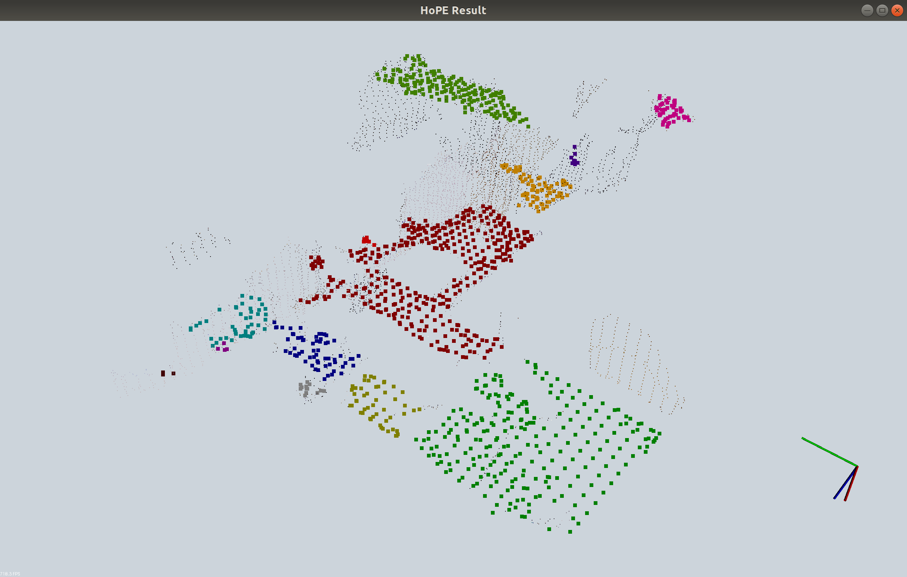

<div align="center">

</div>

**Horizontal Plane Extractor** (or **HoPE** for short) is a ROS package for extracting horizontal planes given 
point cloud input. The planes can be for example the ground or a tabletop surface, with which robotic tasks such 
as navigation or manipulation can be performed with ease.

# Installation
This package requests following dependencies:
* ROS (tested on Indigo, Kinetic, and Melodic)
* PCL 1.7+
* OpenCV (tested on 2.4 and 3.3)
* Boost
* Eigen

On a fresh Ubuntu 14.04+ system, you can install aforementioned packages by installing `ros-<distro>-desktop` using:

```
sudo apt-get install ros-<distro>-desktop ros-<distro>-compressed-*
```

Make sure to change `<distro>` to the ROS distribution you want to use.

After these prerequisites have been met, if you only want to use HoPE without ROS:

```
git clone https://github.com/DrawZeroPoint/hope.git
cd hope
mkdir build & cd build
cmake ..
make -j
```

Or with ROS:

```
cd catkin_ws/src
git clone https://github.com/DrawZeroPoint/hope.git
cd ..
catkin_make
```

# Basic Usage

Assume hope is built without ROS:

```
cd ~/hope/build/devel/lib/hope
roscore
./hope_node ~/hope/example/ 1305031459.259760.png 1305031459.274941.png -0.2171 -0.0799 1.3959 -0.8445 -0.0451 0.0954 0.5251 
```

Or, assume hope/ is built with ROS and located at `~/catkin_ws/devel/lib`

```
cd ~/catkin_ws/devel/lib/hope
roscore
./hope_node ../../../src/hope/example/ 1305031459.259760.png 1305031459.274941.png -0.2171 -0.0799 1.3959 -0.8445 -0.0451 0.0954 0.5251
```

The output should look like this:

<div align="center">

</div>

You can also start it using rosrun, by default, we assume the pointcloud file `model.pcd` is located at `~`

```
roscore
rosrun hope hope_ros
```

**Note that since hope is mainly developed for robotic usage, running roscore beforehand is mandatory in all modes
for now.**

# Advanced Usage
To reproduce the experiments in our paper:

## Test on [TUM](https://vision.in.tum.de/data/datasets/rgbd-dataset) RGB-D data 

Using a single image pair (RGB and depth), in a terminal, navigate to the location of hope_node 
(typically in `hope/build/devel/lib/hope`), run

```
./hope_node {PATH}/TUM/rgbd_dataset_freiburg1_desk/ rgb/1305031459.259760.png depth/1305031459.274941.png -0.2171 -0.0799 1.3959 -0.8445 -0.0451 0.0954 0.5251
```

In this example, we assume that you have already downloaded the TUM RGB-D test set to your local folder `{PATH}`. 
The scenario to test on is given as the first parameter, followed by an RGB-D pair in that folder and the 
camera position parameters (-0.2171 ...), which could be found in the ground_truth.txt within the dataset. 
Please notice that the sequence numbers for an RGB-depth pair are not exactly the same.

## Test on [Indoor Lidar-RGBD](http://redwood-data.org/indoor_lidar_rgbd/) point cloud dataset

With a point cloud file, in the terminal run:

```
./hope_node {PATH}/loft.ply ply
```

The `ply` parameter indicates the type of the point cloud, it can be `ply` or `pcd`. 
Please notice that to use HoPE extracting the horizontal planes within the point cloud, 
we must **align the normal direction of these planes with the z-axis of that scene.** 
We recommend using [CloudCompare](https://www.danielgm.net/cc/) to do that.

## Customize the parameters in real-time ROS usage

The launch files in `launch/` provides some references for using HoPE in real-time. `hope_ros.launch`
initialize the hope node and ready for extracting planes from given point cloud with `cloud_topic`.
Note that this cloud only needs to be a mono one, i.e., no RGB information. To obtain the cloud with devices like 
RGBD cameras, you can turn to `pub_cloud.launch`.

You can get horizontal planes in a certain height range with the dynamic reconfigure tool. This function is 
useful when you only needs a tabletop rather than the ground. Note that the height is relative to the base_link
frame.

## License
MIT.

## Cite
If you referred or used HoPE in your article, please considering cite:
```
@Article{s18103214,
AUTHOR = {Dong, Zhipeng and Gao, Yi and Zhang, Jinfeng and Yan, Yunhui and Wang, Xin and Chen, Fei},
TITLE = {HoPE: Horizontal Plane Extractor for Cluttered 3D Scenes},
JOURNAL = {Sensors},
VOLUME = {18},
YEAR = {2018},
NUMBER = {10},
ARTICLE NUMBER = {3214},
URL = {http://www.mdpi.com/1424-8220/18/10/3214},
ISSN = {1424-8220},
DOI = {10.3390/s18103214}
}
```
